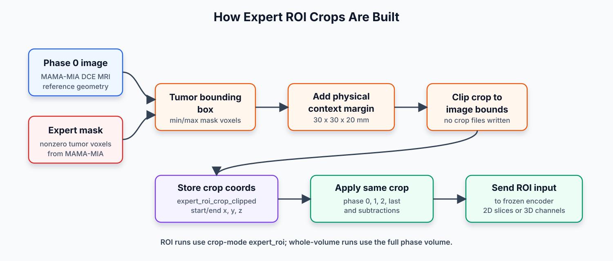
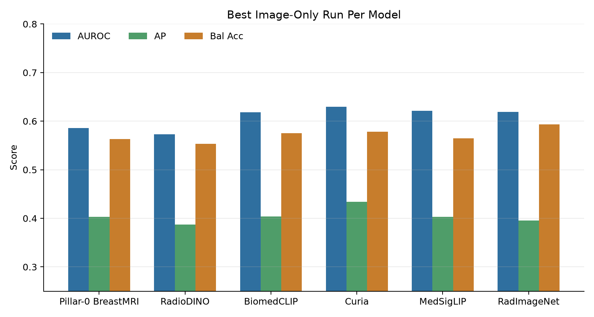
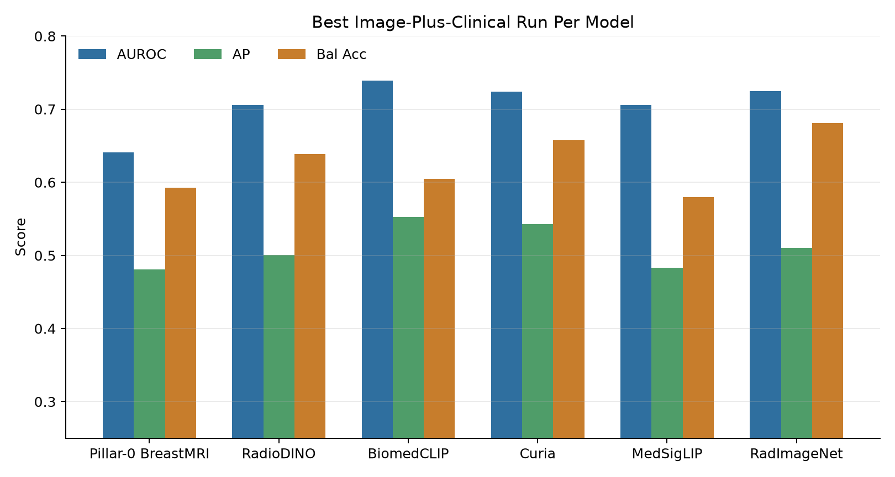

# PhD Project Update

## Longitudinal multimodal breast MRI pCR prediction

**Benchmark snapshot: 22 September 2026**

**Meeting focus**

- Reconstructed longitudinal dataset
- Hugging Face and GitHub release status
- Completed foundation-model benchmark and uncertainty analysis
- Scientific interpretation and next experiments

**Links**

- Dataset: https://huggingface.co/datasets/hfigueiras/LMBM
- GitHub: https://github.com/hugofigueiras/PhD-Thesis

---

# Current Status

- Reconstructed MAMA-MIA-derived longitudinal DCE-MRI dataset uploaded to Hugging Face.
- GitHub repository created for reconstruction code, documentation, benchmark scripts, model registry, and current results.
- Feasible first-pass foundation-model registry screen is complete.
- Current benchmark snapshot: **106 completed probe runs**.
- Aggregate paired-bootstrap and source-cohort robustness analyses are complete.

| Output | Location |
|---|---|
| Dataset release | Hugging Face |
| Project code and docs | GitHub |
| Benchmark registry/results | GitHub |

---

# Project Goal

Predict pathological complete response (**pCR**) to neoadjuvant chemotherapy using:

- breast DCE-MRI imaging;
- clinical and tabular variables;
- eventually longitudinal imaging information across treatment timepoints.

The immediate goal is to build a strong, reproducible baseline before training more complex multimodal or longitudinal models.

---

# Why Reconstruct The Dataset?

MAMA-MIA provides a curated pCR prediction dataset, but it includes one MRI exam per patient.

The original TCIA source datasets often contain multiple exams/timepoints for the same patients.

**Goal:** recover those additional source exams and create a longitudinal extension for MAMA-MIA patients.

| Dataset layer | What it provides |
|---|---|
| MAMA-MIA | Clean metadata, pCR labels, masks, official split |
| Original TCIA datasets | Additional DCE-MRI timepoints |
| Reconstructed release | MAMA-MIA-linked longitudinal DCE-MRI volumes |

---

# Source Datasets

The release links MAMA-MIA patients back to their original public source cohorts:

| Source cohort | Role |
|---|---|
| ISPY1 | Original DCE-MRI exams/timepoints |
| ISPY2 | Original DCE-MRI exams/timepoints |
| Breast MRI NACT Pilot | Original DCE-MRI exams/timepoints |
| MAMA-MIA | Labels, clinical metadata, official splits, masks |

The reconstructed release excludes QC-quarantined patients from the active public upload.

---

# Reconstruction Workflow


---

# What The Release Builder Does

Script:

```text
ReconstructionScripts/build_reconstructed_dataset_release.py
```

It does not reconstruct DICOMs from scratch. It packages the already reconstructed local volumes into a clean public release.

Main jobs:

- scan reconstructed volume folders;
- detect patients, exams/timepoints, and DCE phase files;
- merge MAMA-MIA clinical metadata;
- exclude QC-quarantined patients;
- write patient, exam, phase, and metadata manifests;
- generate release summaries and documentation.

---

# Active Dataset Release

| Cohort | Patients | Exams/timepoints | Phase files |
|---|---:|---:|---:|
| ISPY1 | 145 | 549 | 1,705 |
| ISPY2 | 716 | 2,680 | 19,159 |
| Breast MRI NACT Pilot | 64 | 189 | 588 |
| **Total** | **925** | **3,418** | **21,452** |

Additional structure:

- 15 patients have 1 exam/timepoint.
- 52 patients have 2 exams/timepoints.
- 133 patients have 3 exams/timepoints.
- 725 patients have 4 exams/timepoints.

---

# Dataset Organization

```text
reconstructed_mamamia_longitudinal/
|-- README.md
|-- metadata/
|   |-- clinical_and_imaging_info_active_reconstructed.csv
|   |-- patient_manifest.csv
|   |-- exam_manifest.csv
|   |-- phase_manifest.csv
|   `-- data_dictionary.csv
`-- Reconstructed_Datasets/
    |-- ISPY1-Volumes/
    |-- ISPY2-Volumes/
    `-- NACT-Volumes/
```

Each patient folder contains one or more exam/timepoint folders. Each exam contains DCE phase NIfTI files:

```text
volume_phase0.nii.gz
volume_phase1.nii.gz
volume_phase2.nii.gz
...
```

---

# Metadata Content

Main public table:

```text
metadata/clinical_and_imaging_info_active_reconstructed.csv
```

It contains one row per active released patient and **58 public columns**.

| Column group | Count |
|---|---:|
| Identifier/source-provenance variables | 2 |
| Clinical, treatment, outcome, and tumor-biology variables | 19 |
| Demographic/body-habitus variables | 8 |
| Imaging/acquisition/scanner/TCIA-series variables | 21 |
| Reconstruction and longitudinal-linkage variables | 8 |

---

# Image Geometry Policy

The released NIfTI files preserve native reconstructed geometry.

The dataset release does **not** globally:

- resample all volumes to one voxel spacing;
- resize all images to one matrix size;
- reorient every exam into a single common orientation;
- intensity-normalize the released NIfTI files.

Instead, model-specific preprocessing happens later inside benchmark or training scripts.

---

# Geometry QC Summary

The images are heterogeneous across cohorts, scanners, protocols, and timepoints, but phases within each exam are internally consistent.

| Property | Value |
|---|---:|
| Unique reconstructed shapes | 130 |
| Unique reconstructed voxel spacings | 287 |
| Axial exams/timepoints | 2,680 |
| Sagittal exams/timepoints | 738 |
| Phase-consistent shape | 3,418 / 3,418 |
| Phase-consistent spacing | 3,418 / 3,418 |
| Phase-consistent affine | 3,418 / 3,418 |

---

# Public Release Links

## Hugging Face dataset

https://huggingface.co/datasets/hfigueiras/LMBM

Contains:

- public metadata files;
- active reconstructed NIfTI volumes;
- dataset card;
- citation and usage information.

## GitHub repository

https://github.com/hugofigueiras/PhD-Thesis

Contains:

- reconstruction scripts and documentation;
- benchmark scripts;
- foundation-model registry;
- current benchmark result summaries.

---

# Benchmarking Question

Before training complex models, I am testing a simpler question:

**Do frozen foundation-model embeddings contain useful pCR signal, and do they add value beyond clinical variables?**

Three benchmark settings:

| Setting | Inputs |
|---|---|
| Clinical-only | MAMA-MIA clinical/tabular variables |
| Image-only | Frozen foundation-model patient embedding |
| Image + clinical | Patient embedding concatenated with clinical variables |

---

# Benchmarking Pipeline


Within each run, hyperparameters and the decision threshold are selected using
training data only. Cross-run winner selection is exploratory because many
configurations were compared on the same official test set.

---

# How Image Fusion Is Done


- 2D foundation models: fusion happens **after** the frozen model by concatenating patient embeddings.
- Pillar-0: fusion happens **before** the frozen model by stacking 3D DCE volumes as channels.

---

# Fusion Inputs

| Fusion type | What is sent through the foundation model? | What is fused? |
|---|---|---|
| Single phase | One phase volume, sampled as 2D slices for 2D models | Slice embeddings averaged to one patient vector |
| Subtraction | `phase1 - phase0`, `phase2 - phase0`, or `last - phase0` | Subtraction-volume slice embeddings |
| Raw phase fusion | Separate phase embeddings for phase 0, phase 1, phase 2, and last phase | Patient embeddings concatenated |
| Subtraction fusion | Separate subtraction embeddings | Patient embeddings concatenated |
| All DCE fusion | Raw phase embeddings plus subtraction embeddings | Patient embeddings concatenated |
| Pillar-0 3D fusion | 3D phase triplet or subtraction triplet as channels | Channels fused inside the 3D encoder |

---

# How Expert ROI Crops Are Built



- ROI crops are generated on the fly from the **MAMA-MIA expert mask** on phase 0.
- The tumor bounding box is expanded by a physical margin: **30 x 30 x 20 mm**.
- The same clipped crop coordinates are applied to phase 0, phase 1, phase 2, last phase, and subtraction inputs.
- No cropped NIfTI files are saved; only crop coordinates are stored in the benchmark manifest.

---

# Leakage-Safe Probe Protocol

All first-pass probes use the same classifier:

```text
frozen image embedding and/or clinical variables
  -> train-only imputation and standardization
  -> L2-regularized logistic regression
  -> pCR probability
```

Model selection:

- create validation split only from official training patients;
- select logistic-regression `C` using validation average precision;
- choose threshold using validation balanced accuracy;
- refit final probe on all official training patients;
- evaluate once on official MAMA-MIA test patients.

**Important:** this is leakage-safe within each run, but the final shortlist and
headline winners are test-informed. Their confidence intervals are descriptive,
not confirmatory.

---

# Benchmark Experiment Matrix

Snapshot date: **2026-09-22**.

| Category | Completed runs |
|---|---:|
| Clinical-only probes | 1 |
| Image-only embedding probes | 77 |
| Image-plus-clinical probes | 28 |
| **Total** | **106** |

Of these, **98** are primary modality-matched/reference runs and **8** are the
separate Jolia CT-to-MRI stress test.

All completed runs use the same official split, frozen encoders, patient-level
features, and L2 logistic-regression probe protocol.

---

# Registry Coverage

| Model | Role | Final status |
|---|---|---|
| Pillar-0 BreastMRI | Native 3D breast MRI | Complete |
| RadioDINO | Self-supervised radiology ViT | Complete |
| BiomedCLIP | Biomedical image-text ViT | Complete |
| Curia | CT/MRI radiology ViT | Complete |
| MedSigLIP | General medical image-text ViT | Complete |
| RadImageNet | Supervised radiology CNN | Complete |
| Jolia | CT-to-MRI negative transfer control | Complete, reported separately |
| MOME Breast mpMRI | Multimodal breast MRI | Excluded: required DWI/T2 inputs unavailable |
| MedImageInsight | Cloud embedding model | Access blocked: Azure Limited Preview |
| RadFM | Large 2D/3D radiology VLM | Resource blocked on current hardware |

---

# Headline Results

Official test set: **306 patients**, including **93 pCR cases**.

| Setting | Model | Input | AUROC | AP | Bal Acc |
|---|---|---|---:|---:|---:|
| Clinical-only | Clinical baseline | Clinical variables | 0.735 | 0.502 | 0.642 |
| Best image-only AUROC | Curia | Expert ROI, phase 2 - phase 0 | 0.630 | 0.434 | 0.578 |
| Best image-only AP | Curia | Expert ROI, selected ROI fusion | 0.608 | 0.446 | 0.546 |
| Best image-only balanced accuracy | RadImageNet | Whole, phase 2 - phase 0 | 0.619 | 0.396 | 0.593 |
| Best image + clinical AUROC/AP | BiomedCLIP | Whole volume, phase 1 + clinical | 0.739 | 0.553 | 0.605 |
| Best image + clinical balanced accuracy | RadImageNet | Whole, phase 2 - phase 0 + clinical | 0.725 | 0.510 | 0.681 |

Point estimates alone suggest several winners. The paired uncertainty analysis
below determines whether they reliably improve on clinical-only.

---

# Image-Only Results



---

# Image + Clinical Results



---

# Best Run Per Model: Image-Only

Rows are selected by AUROC within each primary model.

| Model | Crop/input | AUROC | AP | Bal Acc |
|---|---|---:|---:|---:|
| Pillar-0 | ROI, phase 0 + phase 2 + last | 0.586 | 0.403 | 0.563 |
| RadioDINO | ROI, phase 2 - phase 0 | 0.573 | 0.387 | 0.554 |
| BiomedCLIP | Whole, phase 1 | 0.618 | 0.404 | 0.576 |
| Curia | ROI, phase 2 - phase 0 | **0.630** | **0.434** | 0.578 |
| MedSigLIP | ROI, phase 2 - phase 0 | 0.621 | 0.403 | 0.565 |
| RadImageNet | Whole, phase 2 - phase 0 | 0.619 | 0.396 | **0.593** |

Image embeddings carry pCR signal, but every image-only point estimate remains
below the clinical-only baseline.

---

# Best Run Per Model: Image + Clinical

Rows are selected by AUROC within each primary model.

| Model | Crop/input | AUROC | AP | Bal Acc |
|---|---|---:|---:|---:|
| Pillar-0 | ROI, phase 0 + phase 1 + last | 0.641 | 0.481 | 0.592 |
| RadioDINO | ROI, phase 2 - phase 0 | 0.706 | 0.501 | 0.638 |
| BiomedCLIP | Whole, phase 1 | **0.739** | **0.553** | 0.605 |
| Curia | ROI, phase 2 - phase 0 | 0.724 | 0.543 | 0.658 |
| MedSigLIP | Whole, phase 1 | 0.706 | 0.483 | 0.579 |
| RadImageNet | Whole, phase 2 - phase 0 | 0.725 | 0.510 | **0.681** |

Fusion raises several point estimates, but a fair comparison must be paired
against the clinical baseline on the same test patients.

---

# Aggregate Paired Uncertainty

Image + clinical minus clinical-only, using 5,000 paired bootstrap resamples:

Clinical-only AUROC: **0.735 [0.681, 0.786]**.

| Model | Delta AUROC | Delta AP | Delta Bal Acc |
|---|---:|---:|---:|
| BiomedCLIP | +0.004 [-0.037, 0.045] | +0.050 [-0.030, 0.111] | -0.037 [-0.092, 0.017] |
| Curia | -0.011 [-0.070, 0.051] | +0.041 [-0.059, 0.137] | +0.016 [-0.049, 0.082] |
| MedSigLIP | -0.030 [-0.078, 0.020] | -0.019 [-0.109, 0.059] | -0.062 [-0.117, -0.008] |
| Pillar-0 | -0.094 [-0.168, -0.023] | -0.022 [-0.133, 0.076] | -0.049 [-0.118, 0.017] |
| RadImageNet | -0.010 [-0.070, 0.050] | +0.008 [-0.077, 0.094] | +0.039 [-0.022, 0.100] |
| RadioDINO | -0.029 [-0.079, 0.022] | -0.002 [-0.093, 0.079] | -0.003 [-0.057, 0.050] |

**No primary image-plus-clinical configuration shows a stable aggregate gain
over clinical-only on any metric.**

---

# Source-Cohort Robustness

The official test set contains four source cohorts:

| Cohort | N / pCR | Clinical AUROC | Best image + clinical AUROC | Interpretation |
|---|---:|---:|---:|---|
| DUKE | 91 / 30 | 0.787 | 0.754, RadioDINO | No stable AUROC/AP gain |
| ISPY1 | 67 / 14 | 0.760 | 0.783, BiomedCLIP | Delta interval crosses zero |
| ISPY2 | 131 / 46 | 0.687 | **0.786, BiomedCLIP** | **Delta +0.099 [0.026, 0.177]** |
| NACT | 17 / 3 | 0.643 | 0.786, RadImageNet | Too small for ranking |

For ISPY2, BiomedCLIP also improves AP by **+0.188 [0.073, 0.267]**.
This is the clearest hypothesis for follow-up, but it is subgroup analysis, not
external validation, because every source cohort also contributed training data.

---

# Transfer Control And Exclusions

**Jolia CT-to-MRI control**

- Best image-only: 0.551 AUROC, 0.347 AP, 0.555 balanced accuracy.
- Best image + clinical: 0.672 / 0.462 / 0.615.
- All results remain below clinical-only, as expected under CT-to-MRI domain mismatch.

**Transparent exclusions**

- MOME requires a multiparametric input set including DWI and T2; MAMA-MIA does not provide the required modalities.
- MedImageInsight is available through an Azure Limited Preview, not a local checkpoint suitable for this study.
- RadFM's official full-model path requires substantially more compatible memory and software support than the current machine provides.

---

# Scientific Interpretation

- The clinical variables are already a strong predictor of pCR.
- Frozen MRI/radiology representations contain modest image-only signal, with
  Curia, MedSigLIP, BiomedCLIP, and RadImageNet clustering around AUROC 0.62-0.63.
- ROI cropping helps some models, especially Curia and MedSigLIP, but is not a
  universal improvement; RadImageNet and BiomedCLIP favor whole-volume inputs.
- Complex phase concatenation is not consistently better than a carefully
  chosen single phase or subtraction.
- The apparent aggregate fusion gains are not statistically stable after paired
  resampling.
- The ISPY2 result suggests that representation usefulness depends on cohort,
  acquisition, or treatment context.

**Bottom line:** the benchmark does not justify claiming aggregate benefit from
frozen foundation embeddings yet, but it identifies a focused, testable
BiomedCLIP/ISPY2 hypothesis.

---

# Recommended Next Experiments

1. **Lock this benchmark.** Do not select more configurations using the same
   official test set.
2. **Predeclare a leave-one-source-dataset-out study** using clinical-only and a
   small frozen shortlist, with BiomedCLIP as the primary candidate.
3. **Train supervised CNN/ViT baselines** under the same splits to test whether
   frozen embeddings are actually preferable to task-specific learning.
4. **Move to longitudinal modeling** using the reconstructed treatment
   timepoints, while preserving source-level validation.
5. Treat ROI choice, fusion strategy, and operating threshold as training-only
   decisions in every follow-up experiment.

The immediate decision is whether source-generalization or a supervised baseline
should precede the longitudinal experiment.

---

# Discussion Points

Questions for the meeting:

- Is the frozen-foundation-model benchmark sufficiently complete to lock?
- Should the next primary experiment be leave-one-source-dataset-out validation
  or a supervised CNN/ViT baseline?
- Is the BiomedCLIP result in ISPY2 a sufficiently strong hypothesis to
  predeclare as the primary source-specific comparison?
- Which metric should drive future model selection: AUROC, AP, or a clinically
  chosen operating point rather than validation-optimized balanced accuracy?
- Should longitudinal modeling begin only after source generalization is tested?

---

# Appendix: Key Files

| Item | Path |
|---|---|
| Dataset documentation | `docs/dataset.md` |
| Reconstruction workflow | `docs/reconstruction_workflow.md` |
| Benchmarking explanation | `docs/benchmarking.md` |
| Detailed benchmark results | `docs/benchmark_results.md` |
| Foundation model registry | `Benchmarking/foundation_model_registry.csv` |
| Experiment matrix | `Benchmarking/experiment_matrix.md` |
| Full result table | `Benchmarking/outputs/summaries/cross_model_all_results.md` |
| Paired uncertainty | `Benchmarking/outputs/summaries/bootstrap_shortlist_summary.md` |
| Source-cohort analysis | `Benchmarking/outputs/summaries/shortlist_by_dataset_summary.md` |
| Jolia transfer control | `Benchmarking/outputs/summaries/jolia_cross_modality_summary.md` |

Links:

- Hugging Face: https://huggingface.co/datasets/hfigueiras/LMBM
- GitHub: https://github.com/hugofigueiras/PhD-Thesis
