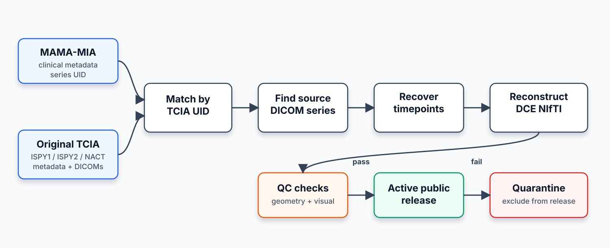
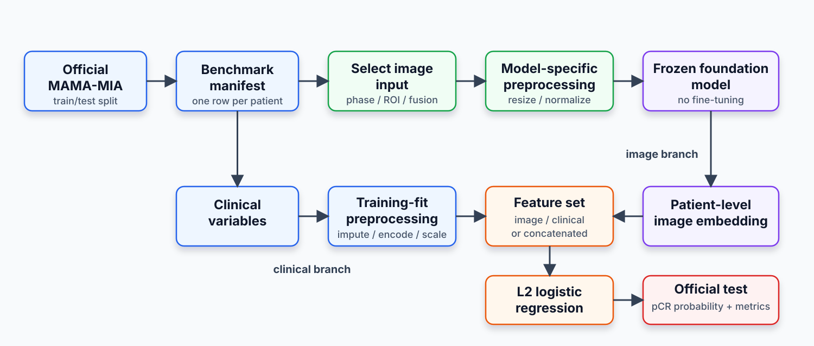
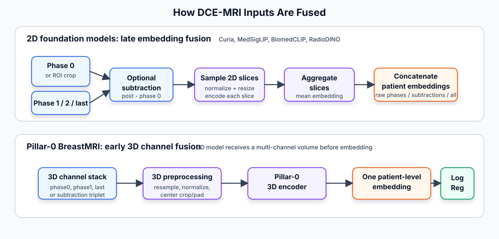

# PhD Project Update

## Longitudinal multimodal breast MRI pCR prediction

**Meeting focus**

- Reconstructed longitudinal dataset
- Hugging Face and GitHub release status
- Foundation-model benchmarking plan and current results
- Next steps

**Links**

- Dataset: https://huggingface.co/datasets/hfigueiras/LMBM
- GitHub: https://github.com/hugofigueiras/PhD-Thesis

---

# Current Status

- Reconstructed MAMA-MIA-derived longitudinal DCE-MRI dataset uploaded to Hugging Face.
- GitHub repository created for reconstruction code, documentation, benchmark scripts, model registry, and current results.
- First-pass foundation-model benchmark is underway.
- Current benchmark snapshot: **73 completed probe runs**.

| Output | Location |
|---|---|
| Dataset release | Hugging Face |
| Project code and docs | GitHub |
| Benchmark registry/results | GitHub |

---

# Project Goal

Predict pathological complete response (**pCR**) to neoadjuvant chemotherapy using:

- breast DCE-MRI imaging;
- clinical and tabular variables;
- eventually longitudinal imaging information across treatment timepoints.

The immediate goal is to build a strong, reproducible baseline before training more complex multimodal or longitudinal models.

---

# Why Reconstruct The Dataset?

MAMA-MIA provides a curated pCR prediction dataset, but it includes one MRI exam per patient.

The original TCIA source datasets often contain multiple exams/timepoints for the same patients.

**Goal:** recover those additional source exams and create a longitudinal extension for MAMA-MIA patients.

| Dataset layer | What it provides |
|---|---|
| MAMA-MIA | Clean metadata, pCR labels, masks, official split |
| Original TCIA datasets | Additional DCE-MRI timepoints |
| Reconstructed release | MAMA-MIA-linked longitudinal DCE-MRI volumes |

---

# Source Datasets

The release links MAMA-MIA patients back to their original public source cohorts:

| Source cohort | Role |
|---|---|
| ISPY1 | Original DCE-MRI exams/timepoints |
| ISPY2 | Original DCE-MRI exams/timepoints |
| Breast MRI NACT Pilot | Original DCE-MRI exams/timepoints |
| MAMA-MIA | Labels, clinical metadata, official splits, masks |

The reconstructed release excludes QC-quarantined patients from the active public upload.

---

# Reconstruction Workflow



---

# What The Release Builder Does

Script:

```text
ReconstructionScripts/build_reconstructed_dataset_release.py
```

It does not reconstruct DICOMs from scratch. It packages the already reconstructed local volumes into a clean public release.

Main jobs:

- scan reconstructed volume folders;
- detect patients, exams/timepoints, and DCE phase files;
- merge MAMA-MIA clinical metadata;
- exclude QC-quarantined patients;
- write patient, exam, phase, and metadata manifests;
- generate release summaries and documentation.

---

# Active Dataset Release

| Cohort | Patients | Exams/timepoints | Phase files |
|---|---:|---:|---:|
| ISPY1 | 145 | 549 | 1,705 |
| ISPY2 | 716 | 2,680 | 19,159 |
| Breast MRI NACT Pilot | 64 | 189 | 588 |
| **Total** | **925** | **3,418** | **21,452** |

Additional structure:

- 15 patients have 1 exam/timepoint.
- 52 patients have 2 exams/timepoints.
- 133 patients have 3 exams/timepoints.
- 725 patients have 4 exams/timepoints.

---

# Dataset Organization

```text
reconstructed_mamamia_longitudinal/
|-- README.md
|-- metadata/
|   |-- clinical_and_imaging_info_active_reconstructed.csv
|   |-- patient_manifest.csv
|   |-- exam_manifest.csv
|   |-- phase_manifest.csv
|   `-- data_dictionary.csv
`-- Reconstructed_Datasets/
    |-- ISPY1-Volumes/
    |-- ISPY2-Volumes/
    `-- NACT-Volumes/
```

Each patient folder contains one or more exam/timepoint folders. Each exam contains DCE phase NIfTI files:

```text
volume_phase0.nii.gz
volume_phase1.nii.gz
volume_phase2.nii.gz
...
```

---

# Metadata Content

Main public table:

```text
metadata/clinical_and_imaging_info_active_reconstructed.csv
```

It contains one row per active released patient and **58 public columns**.

| Column group | Count |
|---|---:|
| Identifier/source-provenance variables | 2 |
| Clinical, treatment, outcome, and tumor-biology variables | 19 |
| Demographic/body-habitus variables | 8 |
| Imaging/acquisition/scanner/TCIA-series variables | 21 |
| Reconstruction and longitudinal-linkage variables | 8 |

---

# Image Geometry Policy

The released NIfTI files preserve native reconstructed geometry.

The dataset release does **not** globally:

- resample all volumes to one voxel spacing;
- resize all images to one matrix size;
- reorient every exam into a single common orientation;
- intensity-normalize the released NIfTI files.

Instead, model-specific preprocessing happens later inside benchmark or training scripts.

---

# Geometry QC Summary

The images are heterogeneous across cohorts, scanners, protocols, and timepoints, but phases within each exam are internally consistent.

| Property | Value |
|---|---:|
| Unique reconstructed shapes | 130 |
| Unique reconstructed voxel spacings | 287 |
| Axial exams/timepoints | 2,680 |
| Sagittal exams/timepoints | 738 |
| Phase-consistent shape | 3,418 / 3,418 |
| Phase-consistent spacing | 3,418 / 3,418 |
| Phase-consistent affine | 3,418 / 3,418 |

---

# Public Release Links

## Hugging Face dataset

https://huggingface.co/datasets/hfigueiras/LMBM

Contains:

- public metadata files;
- active reconstructed NIfTI volumes;
- dataset card;
- citation and usage information.

## GitHub repository

https://github.com/hugofigueiras/PhD-Thesis

Contains:

- reconstruction scripts and documentation;
- benchmark scripts;
- foundation-model registry;
- current benchmark result summaries.

---

# Benchmarking Question

Before training complex models, I am testing a simpler question:

**Do frozen foundation-model embeddings contain useful pCR signal, and do they add value beyond clinical variables?**

Three benchmark settings:

| Setting | Inputs |
|---|---|
| Clinical-only | MAMA-MIA clinical/tabular variables |
| Image-only | Frozen foundation-model patient embedding |
| Image + clinical | Patient embedding concatenated with clinical variables |

---

# Benchmarking Pipeline



Key point: the official test split is used only for final evaluation.

---

# How Image Fusion Is Done



- 2D foundation models: fusion happens **after** the frozen model by concatenating patient embeddings.
- Pillar-0: fusion happens **before** the frozen model by stacking 3D DCE volumes as channels.

---

# Fusion Inputs

| Fusion type | What is sent through the foundation model? | What is fused? |
|---|---|---|
| Single phase | One phase volume, sampled as 2D slices for 2D models | Slice embeddings averaged to one patient vector |
| Subtraction | `phase1 - phase0`, `phase2 - phase0`, or `last - phase0` | Subtraction-volume slice embeddings |
| Raw phase fusion | Separate phase embeddings for phase 0, phase 1, phase 2, and last phase | Patient embeddings concatenated |
| Subtraction fusion | Separate subtraction embeddings | Patient embeddings concatenated |
| All DCE fusion | Raw phase embeddings plus subtraction embeddings | Patient embeddings concatenated |
| Pillar-0 3D fusion | 3D phase triplet or subtraction triplet as channels | Channels fused inside the 3D encoder |

---

# Leakage-Safe Probe Protocol

All first-pass probes use the same classifier:

```text
frozen image embedding and/or clinical variables
  -> train-only imputation and standardization
  -> L2-regularized logistic regression
  -> pCR probability
```

Model selection:

- create validation split only from official training patients;
- select logistic-regression `C` using validation average precision;
- choose threshold using validation balanced accuracy;
- refit final probe on all official training patients;
- evaluate once on official MAMA-MIA test patients.

---

# Benchmark Experiment Matrix

Current snapshot: **73 completed probe runs**.

| Category | Completed runs |
|---|---:|
| Clinical-only probes | 1 |
| Image-only embedding probes | 56 |
| Image-plus-clinical probes | 16 |
| **Total** | **73** |

Main dimensions:

- foundation model;
- whole volume vs expert ROI;
- DCE phase, subtraction, or fusion input;
- clinical-only, image-only, or image-plus-clinical feature set.

---

# Models Tracked

| Model | Why it is included | Current status |
|---|---|---|
| Pillar-0 BreastMRI | 3D breast MRI foundation model | Whole-volume image-only done; ROI pending |
| Curia | CT/MRI 2D radiology slice encoder | First pass complete |
| MedSigLIP | Broad 2D medical image-text encoder | First pass complete |
| BiomedCLIP | Biomedical image-text baseline | First pass complete |
| RadioDINO | Self-supervised radiology ViT | First pass complete |
| MOME Breast mpMRI | Breast mpMRI / pCR-related candidate | Pending weight/preprocessing verification |
| MedImageInsight | General medical image embedding model | Pending access |
| RadImageNet | Radiology CNN transfer baseline | Pending |
| RadFM | 2D/3D radiology VLM candidate | Heavy stage-2 candidate |
| Jolia | CT-only control model | Optional cross-modality stress test |

---

# Current Benchmark Results

Snapshot date: 2026-09-15.

| Setting | Model | Input | AUROC | AP | Bal Acc |
|---|---|---|---:|---:|---:|
| Clinical-only | Clinical baseline | Clinical variables | 0.735 | 0.502 | 0.642 |
| Best image-only AUROC | Curia | Expert ROI, phase 2 - phase 0 | 0.630 | 0.434 | 0.578 |
| Best image-only AP | Curia | Expert ROI, selected ROI fusion | 0.608 | 0.446 | 0.546 |
| Best image + clinical AUROC/AP | BiomedCLIP | Whole volume, phase 1 + clinical | 0.739 | 0.553 | 0.605 |
| Best image + clinical balanced accuracy | Curia | Expert ROI, phase 2 - phase 0 + clinical | 0.724 | 0.543 | 0.658 |

---

# Early Interpretation

Current message to take forward carefully:

- Clinical variables remain a strong baseline.
- Image embeddings do contain pCR signal, but image-only models are not yet stronger than clinical-only.
- Expert ROI inputs often help compared with whole-volume slice aggregation.
- Image-plus-clinical fusion improves selected metrics, especially AP and balanced accuracy.
- No foundation-model setup clearly dominates clinical-only across all metrics yet.

This supports continuing with benchmarking before moving to heavier fine-tuning or longitudinal modeling.

---

# What Is Next?

Dataset/release:

- keep GitHub and Hugging Face documentation updated;
- improve dataset card as the public-facing description evolves.

Benchmarking:

- finish Pillar-0 expert-ROI and image-plus-clinical checks;
- add repeated seeds or cross-validation for shortlisted configurations;
- evaluate whether longitudinal reconstructed timepoints improve pCR prediction;
- compare simple embedding probes against trained CNN/ViT baselines.

---

# Discussion Points

Questions for the meeting:

- Is the released dataset organization clear enough for external users?
- Should the next benchmark focus on:
  - completing the model registry,
  - improving ROI/segmentation-based inputs,
  - or moving to longitudinal modeling?
- Which metrics should be prioritized for advisor-facing comparisons: AUROC, AP, balanced accuracy, sensitivity/specificity?
- How should the GitHub repository be structured for thesis reproducibility vs public usability?

---

# Appendix: Key Files

| Item | Path |
|---|---|
| Dataset documentation | `docs/dataset.md` |
| Reconstruction workflow | `docs/reconstruction_workflow.md` |
| Benchmarking explanation | `docs/benchmarking.md` |
| Detailed benchmark results | `docs/benchmark_results.md` |
| Foundation model registry | `Benchmarking/foundation_model_registry.csv` |
| Experiment matrix | `Benchmarking/experiment_matrix.md` |
| Full result table | `Benchmarking/outputs/summaries/cross_model_all_results.md` |

Links:

- Hugging Face: https://huggingface.co/datasets/hfigueiras/LMBM
- GitHub: https://github.com/hugofigueiras/PhD-Thesis
